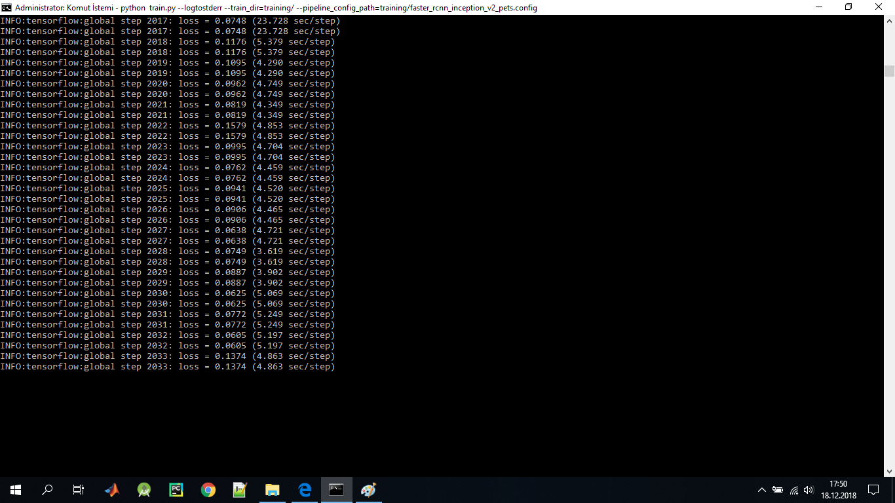
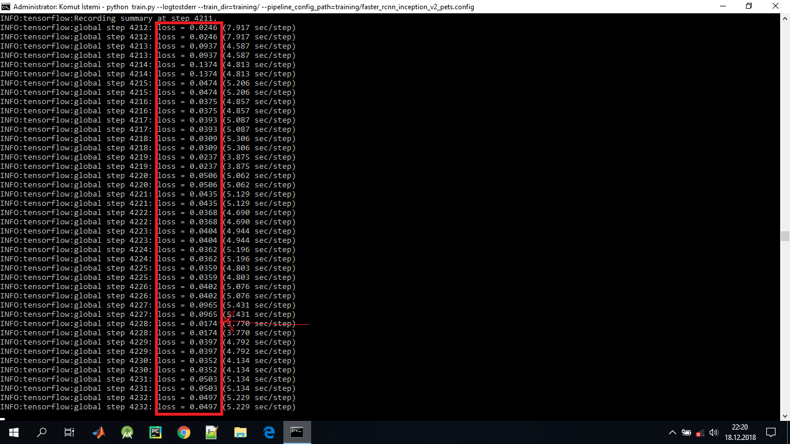
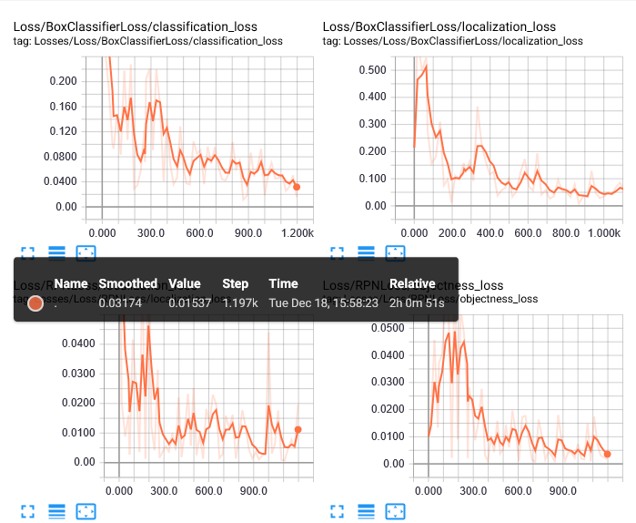
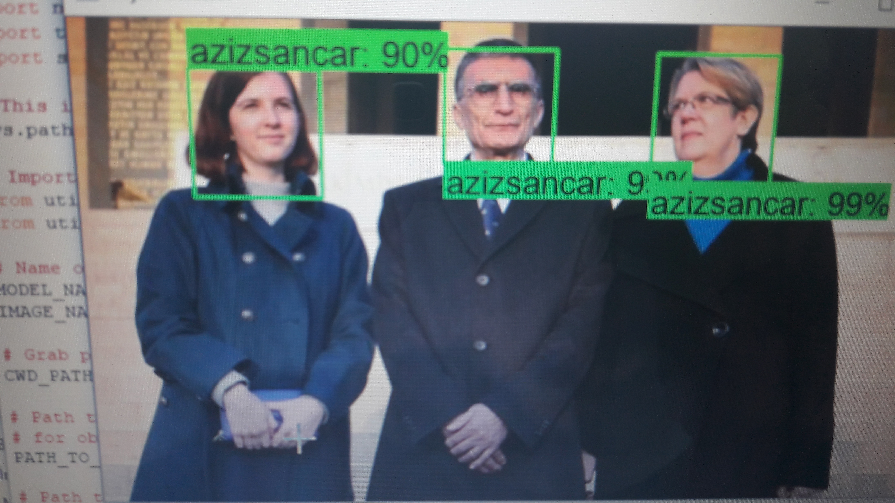
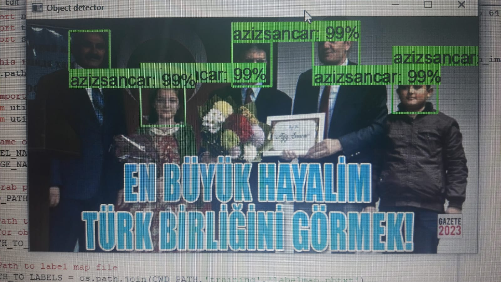
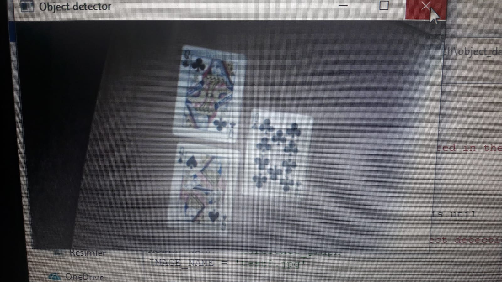

# TENSORFLOW KULLANARAK  DATASET OLUŞTURMA

Tensorflow teknolojisi kullanarak kendi datasetimizi oluşturma
Öncelikle gerekli olan platformların kurulumunun yapılması 
## 1. KURULUM İŞLEMLERİ

### ANACONDA
- https://www.anaconda.com/download/
- İsterseniz yukarıdaki linkten son Anaconda'nın son sürümünü kurmak yerine aşağıdaki linkle 5.1 sürümünü kurabilirsiniz. Anaconda 5.1 daha stabil çalışıyor. 5.1 ile pek hata almazsınız.
- 64-bit Anaconda indirip kurun. Ayrıca Python kurulumu yapmanıza gerek yok. Python Anaconda'yla birlikte gelecek.
- Son güncellemeyle beraber Anaconda Python 3.7 ile beraber gelecektir. Kurstaki kütüphanelerin sorunsuz çalışması için aşağıdaki komutu komut penceresinde çalıştırarak Python 3.6'ya geçin.

  #### ANACONDA VIRTUAL ENVIRONMENT KURULUMU

 Komut penceresini yönetici olarak açın. Virtual environment oluşturmak için aşağıdaki komutu yazın:
  
    conda create -n tensorflow1 pip python=3.6

Virtual environment'ı aktifleştirmek için aşağıdaki komutu kullanın:

    activate tensorflow1

Virtual environment aktifleştiyse parantez içerisinde (tensorflow1) göreceksiniz. Bu virtual environment üzerinde tek tek aşağıdaki tüm kütüphaneleri kurun:

    (tensorflow1) $ conda install -c anaconda protobuf
   
    (tensorflow1) $ pip install pillow
   
    (tensorflow1) $ pip install lxml
   
    (tensorflow1) $ pip install jupyter
   
    (tensorflow1) $ pip install matplotlib
   
    (tensorflow1) $ pip install pandas
   
    (tensorflow1) $ pip install opencv-python
   
    (tensorflow1) $ pip install imageio
   
###### NOT:
   Ne zaman eksik bir kütüphane varsa Tensorflow kurarken yaptığımız gibi pip install ile kurabilirsiniz. 

### TENSORFLOW
 
 - Tensorflow kurarken iki seçeneğiniz var. CPU veya GPU. Eğer uygun ekran kartınız varsa kesinlikle GPU için kurulum yapın, CPU'ya göre daha hızlı eğitim gerçekleşecek. Nvidia'dan farklı bir ekran kartınız varsa CPU için kurulum yapmanız gerekiyor. Sadece Nvidia ekran kartları destekleniyor. Ekran kartınızda CUDA compute capability 3.5'den büyükse Tensorflow'u GPU için kurabilirsiniz. Aşağıdaki linkten ekran kartınız uygun mu kontrol edebilirsiniz.
 
   (tensorflow1) $ pip install --ignore-installed --upgrade tensorflow-cpu
     

    
 #### Tensorflow Object Detection Kurulumu 

- TensorFlow Object Detection API'ı indirin. https://github.com/tensorflow/models

- Masaüstünde tensorflow1 isminde klasör oluşturup indirdiğiniz models klasörünü bu klasörün içine atın. models-master ismini basitleştirmek için models yapabilirsiniz.Benim bilgisayarımda dosya yolu  "home\sedefkilicceken\Desktop\tensorflow1\models\research\object_detection" ve object_detection klasörü içerisinde işlem yapılacaktır.

 - Eğitim yapabilmek için bilgisayarınızın özelliklerine en uygun olan modeli
 https://github.com/tensorflow/models/blob/master/research/object_detection/g3doc/detection_model_zoo.md den indilebilirsiniz.Bize uygun olan model olarak  Faster-RCNN-Inception-V2-COCO'yu indirin. tar.gz dosyasını object detection klasörüne çıkartın.  
 
 
 ## 2. RESİM TOPLAYIP ETİKETLEME

Kendi istediğiniz nesneleri eğitmek istiyorsanız öncelikle bir dataset oluşturmanız lazım. İnternetten veya kendi çektiğiniz foroğraflarla belli bir sayıda resim toplayın. Resimler farklı ortamlarda olursa daha güçlü bir model eğitebilirsiniz. Nesnenin sadece tek bir açıdan çekilmiş resimlerini kullanırsanız iyi sonuçlar almazsınız. Yani datasetinizde çeşitlilik bol olsun. Nesnenin bazı yerleri kapatılmış şekilde ve farklı ışıklandırmalarda resimleri toplayın. 
Biz projjemizde AZİZ SANCAR'ın datasetini topladık.

Resimleri topladıktan sonra %20'sini \object_detection\images\test klasörüne %80'ini \object_detection\images\train klasörüne atın.

Resimleri uygun klasörlere attıktan sonra hepsini tek tek etiketlemeniz gerekiyor. Labellmg ile tüm resimlerdeki tanımak istediğiniz nesneleri tek tek seçerek etiketleme yapın.

Github: https://github.com/tzutalin/labelImg

 

    
 
    

 Her etiketlediğiniz resim için .xml dosyası oluşturulacak. Bu .xml dosyaları tfrecords'a çevirilerek eğitim yapılacak. 
 Test ve train klasörleri içerisindeki her resim için bir tane .xml dosyası olması lazım.
 
 

NOT: Etiketlerde Türkçe karakter olmasın.

Örnek bir xml çıktısı

    
    
## 3. Eğitim Verisi Oluşturma

Her resmi etiketledikten sonra TFRecord oluşturmak gerekiyor. Öncelikle etiket bilgisini barındıran .xml dosyalarını .csv dosyasına çevireceğiz. Bunu yapmak için komut penceresinde object_detection klasöründe olmanız gerekiyor. Daha sonra aşağıdaki komutu çalıştırın. Images klasöründe 2 tane .csv dosyası oluşacak.

    (tensorflow1) $ \tensorflow1\models\research\object_detection> python xml_to_csv.py

.csv dosyaları oluşturulduktan sonra generate_tfrecord.py dosyasını herhangi bir text editor ile açın. 31. satırda sınıf bilgilerinizi girin. Benim datasetimde 1  tane sınıf olduğu için 1 tane farklı ID atadım. Sınıf sayınıza göre bunları değiştirerek 1'den başlayarak sınıf sayınız kadar ID atayın.

    
    def class_text_to_int(row_label):
        if row_label == 'azizsancar':
            return 1
  

Örnek olarak eğer sınıflarınız kedi, köpek, at ise yukarıdaki kodu aşağıdaki şekilde düzenlemeniz gerekir.

   
    def class_text_to_int(row_label):
        if row_label == 'kedi':
            return 1
        elif row_label == 'kopek':
            return 2
        elif row_label == 'at':
            return 3
        else:
            None

Sınıflarınıza ID verdikten sonra aşağıdaki komutlar hem test hem train için TFRecord dosyası oluşturun. Komutları çalıştırdıktan sonra object_detection klasöründe test.record ve train.record dosyaları yaratılacak.

    python generate_tfrecord.py --csv_input=images\train_labels.csv --image_dir=images\train --output_path=train.record
    python generate_tfrecord.py --csv_input=images\test_labels.csv --image_dir=images\test --output_path=test.record
    
    
    
    
    
 ##4. Label Map Oluşturma 
Label map modele hangi ID'de hangi sınıf var onu söylemektedir.İlk işlem olarak  object_detection/training klasörüne gidin ve yeni bir dosya oluşturun. Oluşturduğunuz dosyanın ismine "labelmap.pbtxt" verin (uzantısı .pbtxt olması lazım .txt vermeyin). Dosyayı text editor ile açıp aşağıdaki şekilde sınıf ve ID bilgilerini girin. Bu sınıf ID'leri kendi veri setinize  göre düzenlemeniz gerekiyor
Eğer sınıflar aşağıdaki kedi, köpek, at olsaydı bu dosyanın içeriği şu şekilde olmalıydı:

      item
      {
        id: 1
        name: 'kedi'
      }

      item 
      {
        id: 2
        name: 'kopek'
      }

      item 
      {
       id: 3
       name: 'at'
      }

Kulandığım  sınıf sadece "azizsancar" olduğu için dosya içeriği şu şekilde  düzenlenmeli:

     item
     {
      id: 1
      name: 'azizsancar'
     }

 ## 5.Eğitim Ayarları
Bu aşamada hangi model ve hangi parametreler kullanılacak belirliyoruz.
1.	C:\tensorflow1\models\research\object_detection\samples\configs klasörüne gidin

2.	faster_rcnn_inception_v2_pets.config dosyasını kopyalayıp object_detection\training klasörüne yapıştırın. 

3.	Text editor ile bu dosyayı açın ve aşağıdaki değişiklikleri yapın.

•	9. satır: Buraya sınıf sayınızı yazın. Kullandığım sınıf 1 tane olduğu için 1 olarak düzenlenlenmelidir.

•	110. satır: fine_tune_checkpoint'e aşağıdaki satırı verin. (Hangi modeli kullanmak istiyorsanız onu verin)

     fine_tune_checkpoint : "C:/tensorflow1/models/research/object_detection/faster_rcnn_inception_v2_coco_2018_01_28/model.ckpt"
     
•	126 ve 128. satır: train_input_reader içerisinde input_path ve label_map_path belirleyin. Bunları aşağıdaki satırlardaki gibi değiştirin.

     input_path : "C:/tensorflow1/models/research/object_detection/train.record "
     label_map_path: "C:/tensorflow1/models/research/object_detection/training/labelmap.pbtxt"

•	132. satır: Bu satırda num_examples'a kaç tane test resminiz varsa onu vereceksiniz. images\test klasöründe kaç tane test resminiz olduğunu öğrenebilirsiniz. Ben de 67 tane var. O yüzden num_examples: 67 yazmam gerekiyor.

•	140 ve 142. satır: eval_input_reader içerisinde input_path ve label_map_path belirleyin. Bunları aşağıdaki satırlardaki gibi değiştirin.

    input_path : "C:/tensorflow1/models/research/object_detection/test.record"
    label_map_path: "C:/tensorflow1/models/research/object_detection/training/labelmap.pbtxt"

Yaptığınız değişiklikleri kaydedin.

## 6.Eğitimi Gerçekleştirme
Eğitimi çalıştırmak için aşağıdaki komutu /object_detection klasörü içerisinde çalıştırın.

    python train.py --logtostderr --train_dir=training/ --pipeline_config_path=training/faster_rcnn_inception_v2_pets.config

Aşağıda eğitimin 2000 adımında oluşan loss değerleri gösterilmektedir.

•	Eğitimin başlaması 30 saniye, 1 dakika kadar sürecektir. Adım adım eğitildiğini görüyorsanız eğitim yapılıyor demektir. Her adımda ekrana loss yazdırılacak. Loss'ı takip ederek dilediğiniz kadar eğitin. Benim tavsiyem en az 50 bin adım eğitme yapılarak olumlu sonuç elde edilmektedir. Veri setinize ve modelinize bağlı olarak daha az veya daha fazla eğitim yapmanız da gerekebilir Loss'ı takip ederek bir noktadan sonra grafiğin düzleştiğini gözlemlerseniz eğitimi durdurabilirsiniz. Eğitimi durdurmak için Ctrl+C tuşlarına basın.Belli aralıklarla kaydediliyor kapattıktan sonra kaldığınız yerden eğitime devam edebilirsiniz.Lossları incelediğinizde değerlerinin sıfıra yaklaşması gerekmektedir aksi durumda eğitim gerçekleşmiyor demektir.

 Aşağıda eğitimin 4000 adımında oluşan loss değerleri gösterilmektedir.
 Eğitimin 4000 ‘nci adımında oluşan loss değerleri gösterilmektedir.Ve değerlerin sıfıra yaklaşıldığı görülmektedir.

 

Aşağıdaki komutla  eğitimi Tensorboard'da takip etmek için çalıştırın :

## Program Çıktıları:
4000 adım çıktıları aşağıda verilmiştir.

4000 adım çıktılarında yüz ayrımı yapabilmektedir.

4000 adım olmasına rağmen  yüz haricinde diğer nesneleri algılamamaktadır.

Resimlerde görültüğü gibi  4K eğitim sonucunda sadece insan suratı olup olmadığı ayrılmaktadır.Nesneleri algılamaması, ilk  fotoğrafta köpeği algılamaması, kağıtları tanımaması en azından eğitimin olumlu yönde ilerlediğini göstermektedir.

## Eğitim Sonuçları 
Eğitimin  olumlu sonuç vermesi için en az 50K adım eğitilmesi gerekilmektedir.Fakat tensorFlow cpu kullanması, bilgisayarın donanımsal aksaklıkları ve yetersizlikleri neticesinde eğitim süresi olduğundan fazla sürdü.4K’lık adımı 2 günde yapması 50K  adım eğitim sürecinin çok uzun olacağını  bu yüzden de  veri toplayıp eğitme yöntemini bir hayli zor olduğu kanısınna varılmıştır.

    

    
    
